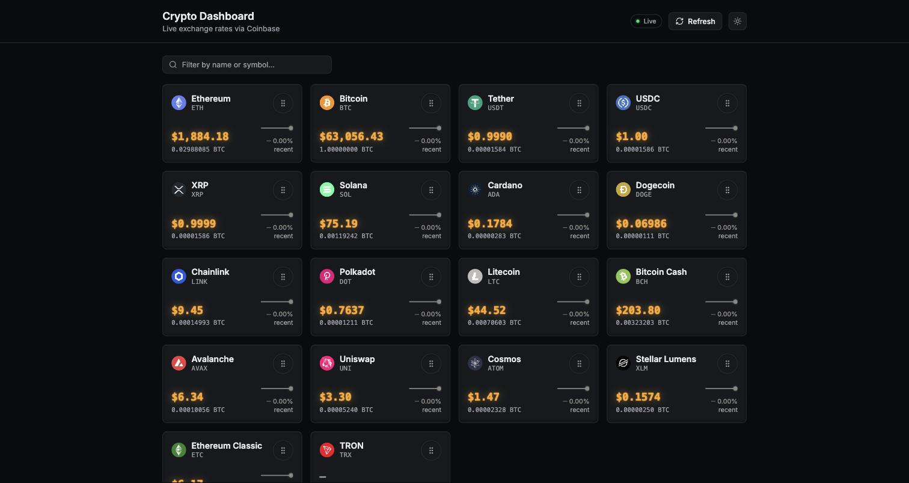
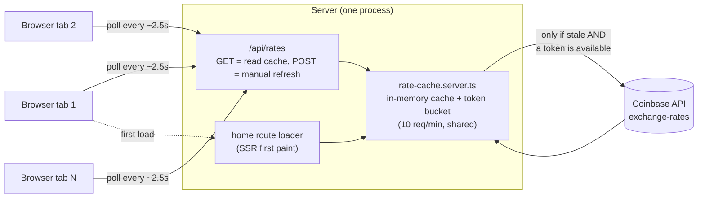

# Crypto Dashboard

A dynamic cryptocurrency dashboard built with React Router (framework mode) and React: live exchange rates from Coinbase, drag-and-drop reordering, and filtering — plus a written and coded resolution of five engineering tensions that show up whenever "real-time data" meets "rate-limited API."



## Tech stack

- **React Router v8** (framework mode) via `create-react-router` — this is the actively maintained successor to classic Remix (same team, same core primitives: `loader`/`action`/`useLoaderData`/`useFetcher`/resource routes). The tech-stack ask was "Remix + React"; this delivers that stack under its current name.
- **TypeScript**, strict mode.
- **Tailwind CSS v4** for styling.
- **@dnd-kit** for drag-and-drop (`core` + `sortable` + `utilities`), with both pointer and keyboard sensors wired up.
- **Vitest + Testing Library + jsdom** for tests.

## Getting started

```bash
npm install
npm run dev        # http://localhost:5173 (or the next free port)
```

Other scripts:

```bash
npm test            # run the test suite once
npm run test:watch  # watch mode
npm run typecheck   # react-router typegen + tsc
npm run build        # production build
npm start            # serve the production build
```

**Environment variables:** none required. Coinbase's `exchange-rates` and `currencies/crypto` endpoints used here are unauthenticated public reads — no API key to provision.

### Why `npm test` isn't just `vitest run`

Node 22+ ships an experimental global `localStorage`, and it shadows jsdom's fully working one inside Vitest's test environment — `window.localStorage` silently becomes `undefined`. `npm test` runs `scripts/run-vitest.mjs`, a small wrapper that **appends** `--no-experimental-webstorage` to `NODE_OPTIONS` (rather than overwriting it via something like `cross-env NODE_OPTIONS=...`, which would clobber any `NODE_OPTIONS` a CI environment already sets, e.g. memory limits).

## Architecture

```
app/
  routes/
    home.tsx                   # dashboard page (registered as the index route in routes.ts); loader does an SSR bootstrap fetch
    api.rates.ts               # GET = cheap cache read, POST = manual refresh (shares the T1 budget)
  services/                    # *.server.ts — excluded from the client bundle
    coinbase.server.ts         # thin Coinbase API client
    rate-cache.server.ts       # T1/T4 engine: token bucket, reactive freshness check, staleness
    coin-catalog.server.ts     # joins the curated coin list with live Coinbase names
    rates-payload.server.ts    # shared wire-payload builder for the loader and the API route
  data/
    top-coins.ts                # curated 18-coin allowlist (also the T4 resilience fallback)
  components/                    # presentational; CryptoCard, CryptoGrid, StalenessBadge, RefreshButton, FilterInput, EmptyState
  hooks/                          # useRatesPolling, useOrderedCoins, useFilteredVisibleCoins
  utils/                          # pure, unit-tested: tokenBucket, staleness, matchesQuery, orderPersistence, reorderWithHidden
  types/                          # shared wire/domain types (coin.ts, rates.ts)
```

**Data flow:** Coinbase → `coinbase.server.ts` → `rate-cache.server.ts` (the *only* thing allowed to call Coinbase; owns the token bucket) → `api.rates.ts` (serves the cache to clients, free reads) + the home route's own loader (SSR first paint) → `useRatesPolling` (polls the free internal route) → React state → re-render. No matter how many browser tabs are open, only a read that decides the cache is stale enough (`ensureFresh`) or a manual-refresh request that wins a token ever calls Coinbase — tabs never call it directly, which is what makes the shared 10/min budget hold across tabs automatically.



Every tab's poll is a free read against the in-memory cache; the only edge that ever costs one of the shared 10 requests/minute is `Cache → Coinbase`, gated by the token bucket — tab count never changes how often that edge fires.

**The math that makes T1 work at all:** `GET /v2/exchange-rates?currency=USD` returns, in one call, `rates[code]` = *units of code per 1 USD* for every currency Coinbase knows about, BTC included. So:

- `usd(coin) = 1 / rates[coin]`
- `btc(coin) = rates.BTC / rates[coin]` (a cross-rate through the shared USD base)

One Coinbase call refreshes USD *and* BTC pricing for the entire coin list — confirmed against a live fetch (`rates.BTC / rates.BTC = 1`, `rates.BTC / rates.ETH ≈ 0.03`, a plausible ETH/BTC ratio).

## Development workflow and tooling

This project was built end-to-end with [Claude Code](https://claude.com/claude-code) (Anthropic's agentic CLI) as the primary development tool, working from this repo's own `CLAUDE.md` and `AGENTS.md` as durable project context across sessions rather than re-deriving conventions each time.

- **Session orchestration — [Xirp](https://xirp.spotify.com/).** The build (scaffolding, the server data layer, core UI, drag-and-drop, the visual redesign, PR review fixes) was split across multiple Claude Code agent sessions coordinated with **Xirp**, Spotify's tool for spawning and tracking agent sessions against isolated git worktrees/branches, so unrelated units of work could proceed independently without one session's in-progress edits colliding with another's.
- **Design system work — the `impeccable` Claude Code skill.** The visual system documented in `DESIGN.md` (and the product context in `PRODUCT.md`) was produced through `impeccable`'s commands rather than freehand styling: `init` to capture product truth, `audit` for accessibility/contrast/responsive passes, `polish`/`animate` for finishing and motion, and its new-work redesign flow for the full "Nixie-Tube Instrument Panel" visual identity — direction selection, a code-led build against a written direction contract, an automated `finish-reviewer` subagent pass that checks the shipped build against that contract and flags concrete fixes, and a `documenter` subagent that regenerates `DESIGN.md` from the actual built code (not from intent) once fixes land.
- **Chart color rules — the `dataviz` Claude Code skill.** The trend sparkline on each card follows `dataviz`'s form-then-color procedure rather than an arbitrary chart palette: the line itself stays in a de-emphasized muted hue (README's "Muted-Line Rule," carried in `DESIGN.md`) with only the current/latest point picked out in a status color (good/critical), and any categorical or status color choice is validated for colorblind-safe contrast before use rather than eyeballed.
- **Code review — GitHub Copilot.** Every feature branch's PR requests a review from `copilot-pull-request-reviewer[bot]` before it's eligible to merge. Comments are triaged individually — fixed when valid, or replied to with concrete evidence when not (e.g. one review round flagged several Tailwind opacity-modifier classes as producing invalid CSS; checking the actual compiled `build/client/assets/*.css` showed Tailwind v4 + lightningcss resolves them correctly via a `color-mix()` `@supports` fallback, so those were answered rather than "fixed").
- **CI — GitHub Actions** (`.github/workflows/ci.yml`). Every push and pull request against `develop` or `main` runs `npm run typecheck`, `npm test`, and `npm run build` on Node 22.
- **Deployment — Vercel.** `main` deploys to production (`https://crypto-dashboard-six-olive.vercel.app`); every pull request gets its own preview deployment. No `vercel.json` — Vercel's native React Router v7 (Vite) framework detection builds the SSR output (`build/server` + `build/client`) directly from `npm run build`.

See `AGENTS.md` for the module boundaries and coding conventions this tooling was expected to follow, and the git branching model (`main` ← `develop` ← `feature/*`, one PR per feature branch).

## Tension Decisions

The assignment names five tensions with no single correct resolution. **T1, T3, T4, and T5 are fully implemented in code** (four of the five, exceeding the "at least two" bar); **T2 is reasoned through below but deliberately descoped** — the reasoning is why.

### T1 — Freshness vs. rate limits — ✅ implemented

**Requirement:** rates must never be staler than 10s while the dashboard is open, but the app is capped at 10 Coinbase requests/minute total, shared across every open tab, including manual refresh.

**Decision:** a single server-side token bucket (`app/services/rate-cache.server.ts`, capacity 10, continuous refill — 1 token every 6s) gates every real Coinbase call. Freshness is checked **reactively on every read** (`ensureFresh`, called from both the home route's loader and `GET /api/rates`): if the cache is older than 8s, that request itself attempts a refresh (if a token is available), rather than a background process refreshing on its own schedule. Manual refresh draws from the **exact same bucket** — there is no separate quota — and if a fetch is already in flight, a new request piggybacks on it instead of spending a second token for a call that wouldn't happen anyway.

**What this buys:** worst-case staleness is bounded by the 8s freshness threshold plus the ~2.5s client poll interval that drives reads — under the 10s requirement with margin — while leaving 2-3 tokens/min of headroom for manual refreshes. Browser tabs never call Coinbase directly; they poll the app's own `/api/rates` route, which is a free in-memory read (that itself may or may not trigger the one server-side call to Coinbase, depending on cache age). That's the property that makes "any number of tabs" a non-issue: tab count only affects cheap internal reads, never the constrained upstream call.

**A real bug this reactive design fixes:** the first version of this cache used a self-rescheduling `setTimeout` loop instead — a background process that woke itself up every ~8s to check freshness independently of any client request. That worked in local dev (`npm run dev`/`npm start` run as one long-lived Node process) but broke in production on Vercel: serverless platforms freeze a function's event loop between invocations, so a timer scheduled during one request simply never fires again once that request's response is sent — the cache got stuck stale indefinitely (observed live: "Stale — 6m ago" that never recovered). Moving the freshness check onto the read path itself — "is the cache stale enough as of *this* request?" — has no dependency on a persistent process at all, and turned out to be a simpler design besides: one fewer moving part (no timer/backoff-schedule bookkeeping), with retry pacing still fully governed by the token bucket alone.

**What was given up / documented limitation:** the token bucket is a single in-process singleton. It only holds "10/min total" per warm server instance — on Vercel that means per warm serverless instance, not globally, and horizontally scaling this app for real would need a shared store (Redis-backed token bucket) to keep the ceiling true across instances. Out of scope here; called out rather than silently ignored.

### T2 — Scale vs. interactivity — 📝 documented, descoped

**Requirement:** handle the API's full currency list (500+) with filtering and drag-and-drop both staying visibly smooth.

**Decision:** ship the curated ~18-coin list (`app/data/top-coins.ts`) as the primary experience, satisfying the base "at least 10 cards" requirement without taking on the highest-risk piece of this whole assignment: virtualization interacting correctly with drag-and-drop.

**The intended design, if this were built:** a threshold-based hybrid — below ~60 visible items, render a plain, fully-mounted `@dnd-kit/sortable` list (simplest, zero special-casing, well within what a browser renders without jank). Above that threshold, switch to `@tanstack/react-virtual` row-based windowing, with dnd-kit's `autoScroll` enabled against the virtualized container so dragging near a viewport edge scrolls it and progressively mounts new rows — the same mechanism large-scale sortable lists (Notion, Trello) use, rather than requiring all 500+ nodes mounted at once. The two modes never fight each other: filtering to a handful of matches naturally drops below the threshold into the simple path; clearing the filter re-engages virtualization.

**Why descoped rather than built:** virtualization + drag-and-drop is a well-known hard combination (only *mounted* rows are draggable; collision detection needs real, current rects for items that may not exist in the DOM yet). Building it convincingly would have meant either shipping something fragile or spending disproportionate time on the one tension explicitly framed as optional. The other four tensions demonstrably work end-to-end instead. This is a scope decision, not a discovered blocker — the design above is concrete enough to build if the coin list ever needs to grow.

### T3 — Instant feel vs. durable order — ✅ implemented

**Requirement:** reordering must feel instant, but the saved order must never be lost or corrupted — including a reload immediately after a drop, or reordering in two tabs at once.

**Decision:** `app/hooks/useOrderedCoins.ts` owns one full order array (`localStorage["crypto-dashboard:coin-order:v1"]`, shape `{ version, updatedAt, order: string[] }`). A plain array of coin codes, not a position map — it's directly usable as dnd-kit's `items` prop, and a position map only pays off at a scale this app doesn't have.

- **Instant feel:** `onDragEnd` updates React state synchronously; the UI never waits on persistence.
- **Reload immediately after a drop:** the `localStorage.setItem` call happens in the *same tick* as the state update (via `setState`'s updater-function form, which also protects against a second reorder landing before React re-renders and computing from a stale array) — there's no debounce window a hard reload could race ahead of.
- **Two tabs reordering at once:** a `storage` event listener adopts an incoming order only if its `updatedAt` is newer than the current one (last-write-wins). Because writes are synchronous on every drop, "the larger timestamp wins" falls out naturally with no merge/CRDT logic needed — this is a single-user ordering preference, not collaborative editing with competing intents to reconcile.
- **Corruption defense:** a schema validator (`isValidOrderPayload`) rejects malformed JSON, wrong versions, non-finite timestamps, and duplicate codes — all of which fall back to catalog order rather than crashing. A partially-valid stored order is *repaired*, not discarded: codes no longer in the catalog are dropped, and new catalog codes missing from the stored order are appended at the end.

### T4 — Resilience vs. simplicity — ✅ implemented

**Requirement:** when the API is slow, throttled, or down, the dashboard must stay useful — last-known-good rates with a clear staleness indicator, not an error page.

**Decision — four tiers, driven by cache age:**

| Tier | Age | UI |
|---|---|---|
| Live | ≤ 10s | green badge |
| Delayed | 10–60s | amber badge, "Delayed, Xs ago" |
| Stale | > 60s | red badge + banner, "Stale — last updated Xm ago"; numbers stay visible |
| Never fetched | no successful fetch yet | gray "Loading…" badge, or red "Unavailable" once a fetch attempt has actually failed |

60s is the stale threshold because, under normal operation (8s freshness threshold with headroom), the gap never approaches 60s from routine budget pressure alone — crossing it is a real signal that something is actually wrong, not a false positive on ordinary variance.

**First-time visitor with the API down (verified live, not just unit-tested):** the dashboard shell renders using the local `top-coins.ts` allowlist for coin identity — no network required — with rate fields showing `—` and an inline (not full-page) banner: *"Live rates are temporarily unavailable — showing the coin list only. Reconnecting automatically."* Filtering and drag-and-drop both keep working immediately, even with zero price data. This was confirmed by pointing `coinbase.server.ts` at an unreachable host and loading a cold cache — the header badge initially said "Loading…" even with a persistent failure, which read as misleading next to a banner that correctly said otherwise, so the badge now distinguishes "still loading" from "actually failed" (`hasError`).

Server-side: a single in-flight-fetch guard means simultaneous cold-start requests from multiple tabs share one fetch rather than each triggering their own; a 5s `AbortController` timeout bounds the worst case. There's no separate failure-backoff schedule to reason about — since freshness checks happen reactively per request rather than on an independent timer, the token bucket alone naturally paces retries during an outage (a failed attempt still spends its token; the next real attempt waits for the bucket to refill).

**What was given up:** the cache is in-memory per server process — it does not survive a restart/redeploy. Acceptable for this scope; a production deployment with multiple instances or frequent redeploys would want an external cache.

### T5 — Filtering × reordering semantics — ✅ implemented

**Requirement:** drag-and-drop must work while a filter is active. Define what happens to the positions of hidden cards when visible ones move.

**Decision:** one canonical full order array is the source of truth; the rendered list is a derived view (`visibleOrder = fullOrder.filter(matchesFilter)`). `app/utils/reorderWithHidden.ts` (pure, unit-tested) translates a drag made against the *visible* subset back into the full array: it finds the absolute index slots the visible items currently occupy, reorders just the visible subsequence, and pours it back into those same slots. **Hidden cards keep their exact absolute position — they're never moved, jumped over, or reshuffled by a drag they weren't part of.**

**Why this is least surprising, versus the alternatives considered:**
- *Hidden items snap to the end* — breaks the mental model that filtering is non-destructive: clearing the filter after one unrelated drag would reveal every hidden coin dumped at the bottom, a large, surprising side effect from an action that never touched them.
- *Filter clears on drag* — directly violates the requirement that drag-and-drop must work while filtered, and yanks the user's context away mid-task.

The chosen rule matches the pattern users already know from filtered lists in tools like Notion, Trello, or a file manager: rows you can't see don't move.

## Testing

Unit tests cover the logic actually being judged here: the token bucket's refill/exhaustion behavior, staleness tier boundaries at exactly 10,000ms/60,000ms, the rate cache's budget-sharing and piggyback-on-inflight-fetch behavior, order persistence's schema validation and catalog-merge repair, and the T5 slot-preserving reorder algorithm (including hidden-item-sandwiched and drop-at-start/end edge cases). A component test drives the real `DndContext → onDragEnd → onReorder` wiring deterministically (`getBoundingClientRect` mocked, since jsdom has no real layout engine) — this is the reliable source of truth for the drag-and-drop wiring, since real pointer/keyboard drag simulation via browser automation proved flaky in a sandboxed CDP environment (a known category of friction with pointer-based DnD libraries and automated input).
